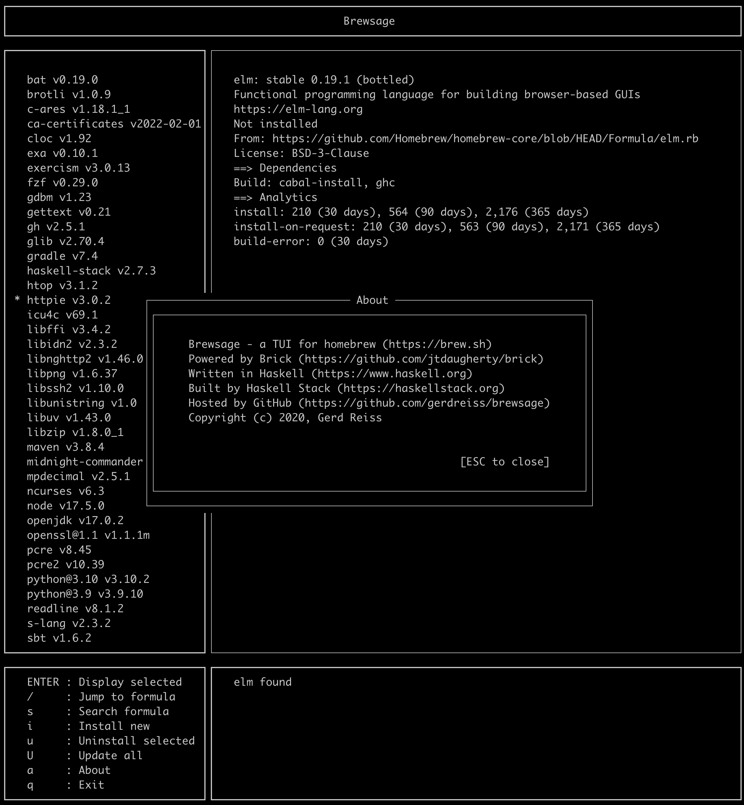

# brewsage

## CLI

Checks dependants of each installed homebrew formula, and offers deletion of each of formulas that no other formula depends on

## TUI

Calling ```brewsage --tui``` opens the application in a TUI (terminal user interface), powered by [Brick](https://github.com/jtdaugherty/brick)


